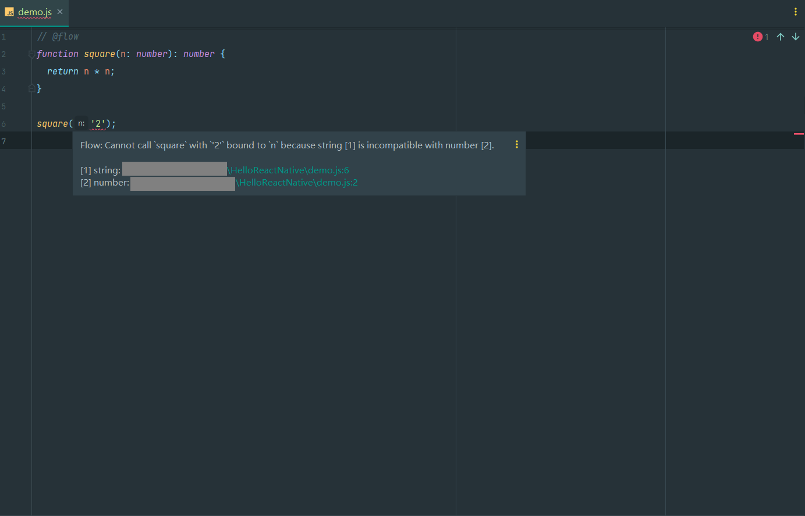
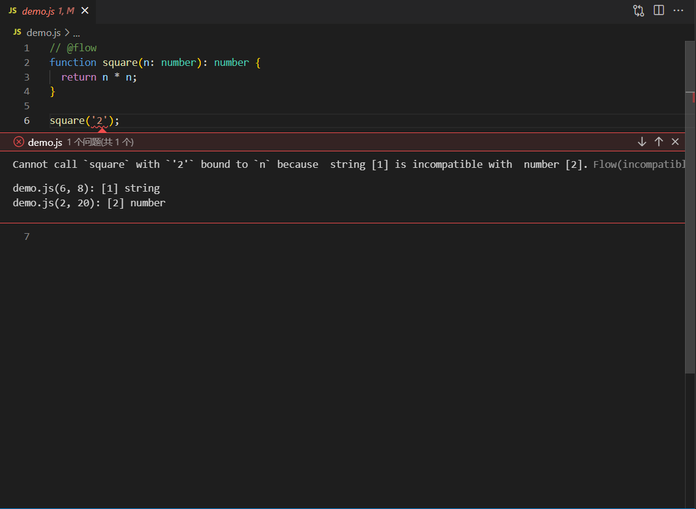

# ReactNative代码检查和格式化 - Flow

## Flow简介

> JavaScript是一种动态类型语言，不像静态类型语言在编译时期进行类型检查，动态类型语言在运行时期进行类型检查。

Flow是一个JavaScript静态类型检查工具，通过静态类型注解检查代码是否存在错误。

```javascript
// @flow
function square(n: number): number {
  return n * n;
}

square("2"); // Error!
```


## React Native项目安装Flow

React Native项目中默认包含Flow的配置文件`.flowconfig`，文件中`[version]`配置了Flow的版本，以React Native 0.69.3为例，使用的Flow版本为`^0.176.3`（即`>=0.176.3 <0.177.0`）。

```ini
[version]
^0.176.3
```

在项目中安装对应版本的Flow。

```shell
yarn add --dev flow-bin@^0.176.3
# or
npm install -save-dev flow-bin@^0.176.3
```

> 不建议全局安装Flow或使用全局安装的Flow，因为各项目中使用的Flow版本可能不同。


## 代码编辑器集成Flow

### WebStorm集成Flow

- 配置Flow
  - `Settings` -> `Languages & Frameworks | JavaScript`
  - `JavaScript Language Version`列表中选择`Flow`
  - `Flow package or executable`指向项目中`node_modules/flow-bin`目录
  - `Use Flow server for`中勾选`Type checking`和`Navigation, code completion, and type hinting`以开启类型检查、类型提示和代码补充等功能
  - `Save all modified files automatically`勾选以开启自动保存所有修改文件功能，因为Flow仅在保存所有其他修改的文件后才检查当前文件


- 代码检查




### Visual Studio Code集成Flow

- 安装Flow扩展[Flow Language Support](https://marketplace.visualstudio.com/items?itemName=flowtype.flow-for-vscode)


- 在设置中禁用JavaScript验证`javascript.validate.enable`

> 建议该配置仅在工作区设置中修改，避免影响到其他项目。


- 代码检查




## Flow基础

### Primitive Types（原始类型）

- 布尔值

```javascript
// @flow
function acceptsBoolean(value: boolean) {
  // ...
}

acceptsBoolean(true); // Works!
acceptsBoolean(false); // Works!
acceptsBoolean(Boolean(0)); // Works!
acceptsBoolean(0); // Error!
acceptsBoolean('foo'); // Error!
```


- 字符串

```javascript
// @flow
function acceptsString(value: string) {
  // ...
}

acceptsString('foo'); // Works!
acceptsString(false); // Error!

'foo' + 'foo'; // Works!
'foo' + 42; // Works!
'foo' + {}; // Error!
'foo' + []; // Error!
```


- 数字

```javascript
// @flow
function acceptsNumber(value: number) {
  // ...
}

acceptsNumber(42); // Works!
acceptsNumber(3.14); // Works!
acceptsNumber(NaN); // Works!
acceptsNumber(Infinity); // Works!
acceptsNumber('foo'); // Error!
```


- `null`和`undefined`（在Flow中为`void`）

```javascript
// @flow
function acceptsNull(value: null) {
  /* ... */
}

function acceptsUndefined(value: void) {
  /* ... */
}

acceptsNull(null); // Works!
acceptsNull(undefined); // Error!
acceptsUndefined(null); // Error!
acceptsUndefined(undefined); // Works!
```


### Literal Types（字面类型）

```javascript
// @flow
function acceptsTwo(value: 2) {
  // ...
}

acceptsTwo(2); // Works!
acceptsTwo(3); // Error!
acceptsTwo('2'); // Error!

function getColor(name: 'success' | 'warning' | 'danger') {
  switch (name) {
    case 'success':
      return 'green';
    case 'warning':
      return 'yellow';
    case 'danger':
      return 'red';
  }
}

getColor('success'); // Works!
getColor('danger'); // Works!
getColor('error'); // Error!
```


### Mixed Types（混合类型） ——避免使用

`mixed`接受任何类型的值。

```javascript
// @flow
function stringify(value: mixed) {
  // ...
}

stringify('foo'); // Works!
stringify(3.14); // Works!
stringify(null); // Works!
stringify({}); // Works!
```


### Any Types（任意类型）——避免使用

`any`不使用类型检查。

```javascript
// @flow
function add(one: any, two: any): number {
  return one + two;
}

add(1, 2); // Works.
add('1', '2'); // Works.
add({}, []); // Works.
```


### Maybe Types（可选类型）

```javascript
// @flow
function acceptsMaybeNumber(value: ?number) {
  // ...
}

acceptsMaybeNumber(42); // Works!
acceptsMaybeNumber(); // Works!
acceptsMaybeNumber(undefined); // Works!
acceptsMaybeNumber(null); // Works!
acceptsMaybeNumber('42'); // Error!

function acceptsMaybeProp({value}: {value: ?number}) {
  // ...
}

acceptsMaybeProp({value: undefined}); // Works!
acceptsMaybeProp({}); // Error!
```


### Variable Types（变量类型）

```javascript
// @flow
const fooConst /* : number */ = 1;
const barConst: number = 2;

var fooVar /* : number */ = 1;
let fooLet /* : number */ = 1;
var barVar: number = 2;
let barLet: number = 2;

let foo: number = 1;
foo = 2; // Works!
foo = '3'; // Error!
```


### Function Types（函数类型）

```javascript
// @flow
function concat(a: string, b: string): string {
  return a + b;
}

concat('foo', 'bar'); // Works!
concat(true, false); // Error!
```


- 可选参数

```javascript
// @flow
function method(optionalValue?: string) {
  // ...
}

method(); // Works.
method(undefined); // Works.
method('string'); // Works.
method(null); // Error!
```


- 可变参数

```javascript
// @flow
function method(...args: Array<number>) {
  // ...
}

method(); // Works.
method(1); // Works.
method(1, 2); // Works.
method(1, 2, 3); // Works.
```


- 函数返回

```javascript
// @flow
function method(): number {
  // ...
}
```


### Object Types（对象类型）

```javascript
// @flow
let obj1: {foo: boolean} = {foo: true};
let obj2: {
  foo: number,
  bar: boolean,
  baz: string,
} = {
  foo: 1,
  bar: true,
  baz: 'three',
};
```


- 可选对象类型属性

```javascript
// @flow
let obj: {foo?: boolean} = {};

obj.foo = true; // Works!
obj.foo = 'hello'; // Error!

function acceptsObject(value: {foo?: string}) {
  // ...
}

acceptsObject({foo: 'bar'}); // Works!
acceptsObject({foo: undefined}); // Works!
acceptsObject({foo: null}); // Error!
acceptsObject({}); // Works!
```


- 精确对象类型

```javascript
// @flow
function method(obj: {foo: string}) {
  // ...
}

method({foo: 'test', bar: 42}); // Works!

let foo: {|foo: string|} = {foo: 'Hello', bar: 'World!'}; // Error!
```


### Array Types（数组类型）

```javascript
// @flow
let arr1: Array<number> = [1, 2, 3];
let arr2: Array<boolean> = [true, false, true];
let arr3: Array<string> = ['A', 'B', 'C'];
let arr4: Array<mixed> = [1, true, 'three'];

let arrShorter1: number[] = [0, 1, 2, 3];
let arrShorter2: ?(number[]) = null; // Works!
let arrShorter3: ?(number[]) = [1, 2]; // Works!
let arrShorter4: ?(number[]) = [null]; // Error!

let arr5: (?number)[] = null; // Error!
let arr6: (?number)[] = [1, 2]; // Works!
let arr7: (?number)[] = [null]; // Works!
```


- 只读数组

```javascript
// @flow
const readonlyArray: $ReadOnlyArray<number> = [1, 2, 3];

const first = readonlyArray[0]; // Works!
readonlyArray[1] = 20; // Error!
readonlyArray.push(4); // Error!
```


### Tuple Types（元组类型）

```javascript
// @flow
let tuple1: [number] = [1];
let tuple2: [number, boolean] = [1, true];
let tuple3: [number, boolean, string] = [1, true, 'three'];

let tuple: [number, boolean, string] = [1, true, 'three'];

let num: number = tuple[0]; // Works!
let bool: boolean = tuple[1]; // Works!
let str: string = tuple[2]; // Works!

tuple[0] = 2; // Works!
tuple[1] = false; // Works!
tuple[2] = 'foo'; // Works!

tuple[0] = 'bar'; // Error!
tuple[1] = 42; // Error!
tuple[2] = false; // Error!
```


- 元组只匹配长度相同的元组

```javascript
// @flow
let tuple1: [number, boolean] = [1, true];
let tuple2: [number, boolean, void] = tuple1; // Error!

let tuple3: [number, boolean, void] = [1, true];
let tuple4: [number, boolean] = tuple3; // Error!
```


- 元组与数组类型不匹配

```javascript
// @flow
let array1: Array<number> = [1, 2];
let tuple1: [number, number] = array1; // Error!

let tuple2: [number, number] = [1, 2];
let array2: Array<number> = tuple2; // Error!
```


- 不能对元组使用变异数组方法

```javascript
// @flow
let tuple: [number, number] = [1, 2];
tuple.join(','); // Works!
tuple.push(3); // Error!
```


### Type Aliases（类型别名）

```javascript
// @flow
type MyObject = {
  // ...
};

let val: MyObject = {
  /* ... */
};

function method(val: MyObject) {
  /* ... */
}

class Foo {
  constructor(val: MyObject) {
    /* ... */
  }
}
```


- 任何类型都可以出现在类型别名中

```javascript
// @flow
type NumberAlias = number;
type ObjectAlias = {
  property: string,
  method(): number,
};
type UnionAlias = 1 | 2 | 3;
type AliasAlias = ObjectAlias;
```


### Interface Types（接口类型）

```javascript
// @flow
interface Serializable {
  serialize(): string;
}

class Foo {
  serialize() {
    return '[Foo]';
  }
}

class Bar {
  serialize() {
    return '[Bar]';
  }
}

const foo: Serializable = new Foo(); // Works!
const bar: Serializable = new Bar(); // Works!
```


- 接口只读属性

属性名称前添加`+`使属性只读。

```javascript
// @flow
interface Invariant {
  property: number | string;
}

interface Covariant {
  +readOnly: number | string;
}

function method1(value: Invariant) {
  value.property; // Works!
  value.property = 3.14; // Works!
}

function method2(value: Covariant) {
  value.readOnly; // Works!
  value.readOnly = 3.14; // Error!
}
```


- 接口只写属性

属性名称前添加`-`使属性只写。

```javascript
// @flow
interface Invariant {
  property: number;
}

interface Contravariant {
  -writeOnly: number;
}

function method1(value: Invariant) {
  value.property; // Works!
  value.property = 3.14; // Works!
}

function method2(value: Contravariant) {
  value.writeOnly; // Error!
  value.writeOnly = 3.14; // Works!
}
```


### Generic Types（泛型类型）

- 函数泛型

```javascript
// @flow
function method<T>(param: T): T {
  // ...
}
```


- 函数类型泛型

```javascript
// @flow
function method(func: <T>(param: T) => T) {
  // ...
}
```


- 类泛型

```javascript
// @flow
class Item<T> {
  prop: T;

  constructor(param: T) {
    this.prop = param;
  }

  method(): T {
    return this.prop;
  }
}
```


- 类型别名泛型

```javascript
// @flow
type MyObject<A, B, C> = {
  foo: A,
  bar: B,
  baz: C,
};

let val: MyObject<number, boolean, string> = {
  foo: 1,
  bar: true,
  baz: 'three',
};
```


- 接口泛型

```javascript
// @flow
interface MyInterface<A, B, C> {
  foo: A;
  bar: B;
  baz: C;
}

let val: MyInterface<number, boolean, string> = {
  foo: 1,
  bar: true,
  baz: 'three',
};
```


### Union Types（联合类型）

```javascript
// @flow
function toStringPrimitives(value: number | boolean | string) {
  return String(value);
}

toStringPrimitives(1); // Works!
toStringPrimitives(true); // Works!
toStringPrimitives('three'); // Works!

toStringPrimitives({prop: 'val'}); // Error!
toStringPrimitives([1, 2, 3, 4, 5]); // Error!
```


- 联合类型要求一进全出

接收联合类型的函数，必须传入其中一种类型，但函数内部需要处理所有可能的类型。

```javascript
// @flow
function toStringPrimitives(value: number | boolean | string): string { // Error!
  if (typeof value === 'number') {
    return String(value);
  } else if (typeof value === 'boolean') {
    return String(value);
  }
}
```


- 不相交对象联合

```javascript
// @flow
type Response = {
  type: 'success' | 'error',
  value?: number,
  error?: string,
};

function handleResponse(response: Response) {
  if (response.type === 'success') {
    const value: number = response.value; // Error!
  } else {
    const error: string = response.error; // Error!
  }
}
```

```javascript
// @flow
type Response = {type: 'success', value: 23} | {type: 'error', error: string};

function handleResponse(response: Response) {
  if (response.type === 'success') {
    const value: number = response.value; // Works!
  } else {
    const error: string = response.error; // Works!
  }
}
```


- 精确类型的不相交联合

```javascript
// @flow
type Success = {success: true, value: boolean};
type Failed = {error: true, message: string};

function handleResponse(response: Success | Failed) {
  if (response.success) {
    let value: boolean = response.value; // Error!
  }
}
```

```javascript
// @flow
type Success = {|success: true, value: boolean|};
type Failed = {|error: true, message: string|};

type Response = Success | Failed;

function handleResponse(response: Response) {
  if (response.success) {
    let value: boolean = response.value;
  } else {
    let message: string = response.message;
  }
}
```


### Intersection Types（相交类型）

```javascript
// @flow
type A = {a: number};
type B = {b: boolean};
type C = {c: string};

function method(value: A & B & C) {
  // ...
}

method({a: 1}); // Error!
method({a: 1, b: true}); // Error!
method({a: 1, b: true, c: 'three'}); // Works!
```


- 相交类型要求全进一出

接收相交类型的函数，必须传入所有类型，但函数内部只需要将其视为其中任何一种类型。

```javascript
// @flow
type A = {a: number};
type B = {b: boolean};
type C = {c: string};

function method(value: A & B & C) {
  let a: A = value;
  let b: B = value;
  let c: C = value;
}
```


- 函数类型的相交

> Flow只会选择第一个匹配的重载。

```javascript
// @flow
type Fn = ((x: 'string') => string) &
  ((x: 'number') => number) &
  ((x: string) => null);

declare var fn: Fn;
let a: string = fn('string'); // Works!
let b: number = fn('number'); // Works!
let c: boolean = fn('boolean'); // Error!
```


- 声明重载函数

```javascript
// @flow
declare function fn(x: 'string'): string;

declare function fn(x: 'number'): number;

declare function fn(x: string): null;

function fn(x) {
  if (x === 'string') {
    return '';
  } else if (x === 'number') {
    return 0;
  } else {
    return null;
  }
}
```


- 对象类型的相交

```javascript
// @flow
type One = {foo: number};
type Two = {bar: boolean};

type Both = One & Two;

let value: Both = {
  foo: 1,
  bar: true,
};
```

> Flow只会选择第一个匹配的对象类型。

```javascript
// @flow
type One = {prop: number};
type Two = {prop: boolean};

declare var both: One & Two;

let prop1: number = both.prop; // Works!
let prop2: boolean = both.prop; // Error!
```


- 不可能的相交类型

```javascript
// @flow
type NumberAndString = number & string;

function method(value: NumberAndString) {
  // ...
}

method(3.14); // Error!
method('hi'); // Error!
```


### Typeof Types（Typeof类型）

```javascript
// @flow
let num1 = 42;
let num2: typeof num1 = 3.14; // Works!
let num3: typeof num1 = 'world'; // Error!

let bool1 = true;
let bool2: typeof bool1 = false; // Works!
let bool3: typeof bool1 = 42; // Error!

let str1 = 'hello';
let str2: typeof str1 = 'world'; // Works!
let str3: typeof str1 = false; // Error!

let numLiteral1: 42 = 42;
let numLiteral2: typeof numLiteral1 = 3.14; // Error!

let boolLiteral1: true = true;
let boolLiteral2: typeof boolLiteral1 = false; // Error!

let strLiteral1: 'hello' = 'hello';
let strLiteral2: typeof strLiteral1 = 'world'; // Error!

let obj1 = {foo: 1, bar: true, baz: 'three'};
let obj2: typeof obj1 = {foo: 42, bar: false, baz: 'hello'}; // Works!

let arr1 = [1, 2, 3];
let arr2: typeof arr1 = [3, 2, 1]; // Works!
```


### Module Types（模块类型）

`exports.js`

```javascript
// @flow
export default class Foo {}
export type MyObject = {
  /* ... */
};

export interface MyInterface {
  /* ... */
}
```

`imports.js`

```javascript
// @flow
import type Foo, {MyInterface, MyObject} from './exports';
```


### Comment Types（注释类型）

- 类型包含注释

在注释开头添加`::`或`flow-include`实现类型包含注释。

```javascript
// @flow
/*::
type Foo = {
  foo: number,
  bar: boolean,
  baz: string
};
*/

class MyClass {
  /*:: prop: string; */
}
```

```javascript
// @flow
/*flow-include
type Foo = {
  foo: number,
  bar: boolean,
  baz: string
};
*/

class MyClass {
  /*flow-include prop: string; */
}
```


- 类型注解注释

在注释开头添加`:`实现类型注解注释。

```javascript
// @flow
function method(param /*: string */) /*: number */ {
  // ...
}
```


## React Native项目使用Flow

### 组件

```react
// @flow
import * as React from 'react';
import {Text} from 'react-native';

type Props = {
  foo: number,
  bar?: string,
};

function MyComponent(props: Props) {
  props.doesNotExist; // Error!
  return <Text>{props.bar}</Text>;
}

<MyComponent foo={42} />;
```


- 组件参数默认值

```react
// @flow
import * as React from 'react';
import {Text} from 'react-native';

type Props = {
  foo: number,
};

function MyComponent(props: Props) {
  return <Text>{props.foo}</Text>;
}

MyComponent.defaultProps = {
  foo: 42,
};

<MyComponent />;
```


### 上下文

```jsx
// @flow
import React from 'react';

const Theme = React.createContext();

<Theme.Provider value="light" />;

<Theme.Consumer>{value => value.toUpperCase()}</Theme.Consumer>; // Error!

<Theme.Consumer>
  {value => (value ? value.toUpperCase() : null)}
</Theme.Consumer>;
```

```jsx
// @flow
import React from 'react';

const Theme = React.createContext<'light' | 'dark'>('light');

<Theme.Provider value="blue" />; // Error!
```


### 其他

事件处理、Redux和类型参考等专题请在[官网](https://flow.org/en/docs/react/)阅读学习。


## 参考

- [Type system - Wikipedia](https://en.wikipedia.org/wiki/Type_system)
- [Documentation - Flow](https://flow.org/)
- [Learn how to use Flow with Create React App - Flow](https://flow.org/en/docs/tools/create-react-app/)
- [How to pin your project to a specific version of Flow - Flow](https://flow.org/en/docs/config/version/)
- [Flow integration for the Visual Studio Code editor - Flow](https://flow.org/en/docs/editors/vscode/)
- [Using the flow type checker - WebStorm](https://www.jetbrains.com/help/webstorm/using-the-flow-type-checker.html)