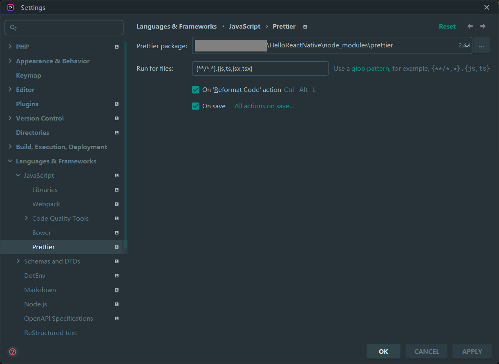
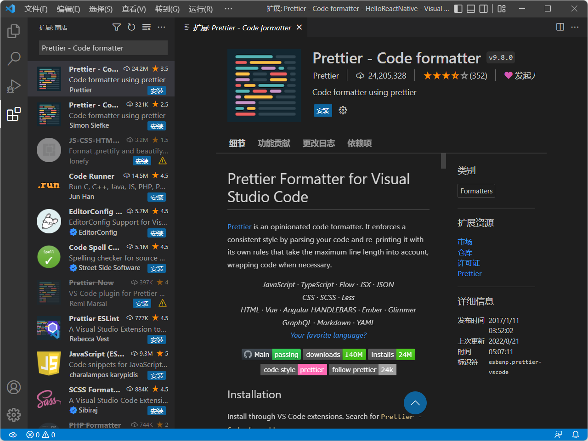
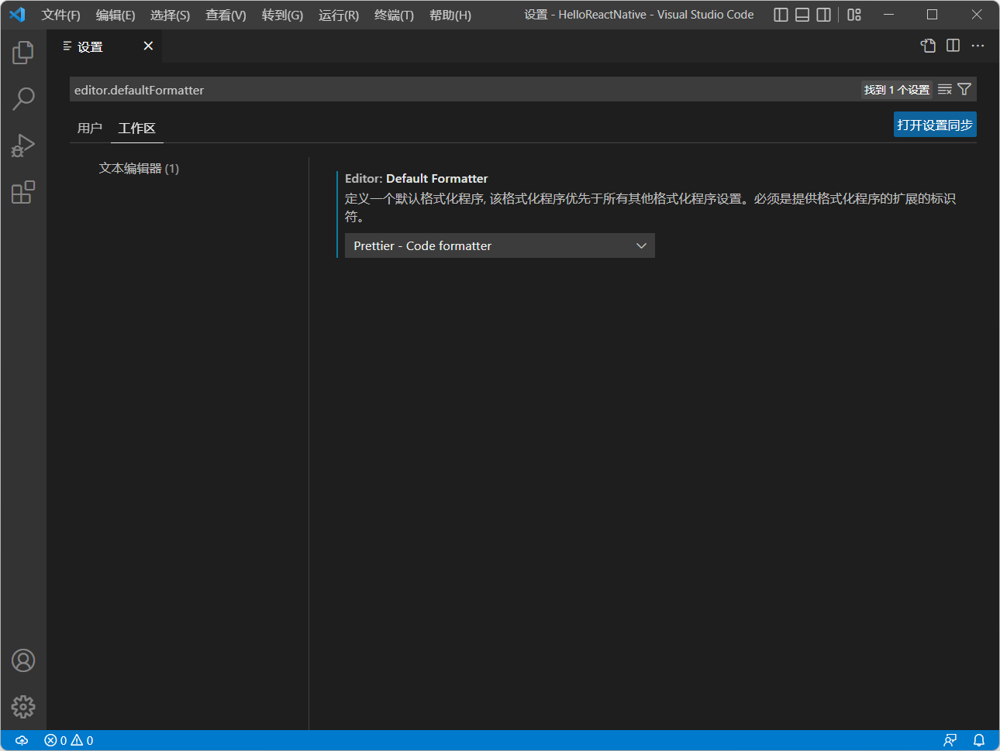

# ReactNative代码检查和格式化 - Prettier

## Prettier简介

Prettier是一个代码格式化工具，它能删除所有原始样式并确保所有输出的代码符合一致的样式。

```jsx
function HelloWorld({greeting = "hello", greeted = '"World"', silent = false, onMouseOver,}) {

  if(!greeting){return null};

     // TODO: Don't use random in render
  let num = Math.floor (Math.random() * 1E+7).toString().replace(/\.\d+/ig, "")

  return <div className='HelloWorld' title={`You are visitor number ${ num }`} onMouseOver={onMouseOver}>

    <strong>{ greeting.slice( 0, 1 ).toUpperCase() + greeting.slice(1).toLowerCase() }</strong>
    {greeting.endsWith(",") ? " " : <span style={{color: '\grey'}}>", "</span> }
    <em>
	{ greeted }
	</em>
    { (silent)
      ? "."
      : "!"}

    </div>;

}
```

```jsx
function HelloWorld({
  greeting = "hello",
  greeted = '"World"',
  silent = false,
  onMouseOver,
}) {
  if (!greeting) {
    return null;
  }

  // TODO: Don't use random in render
  let num = Math.floor(Math.random() * 1e7)
    .toString()
    .replace(/\.\d+/gi, "");

  return (
    <div
      className="HelloWorld"
      title={`You are visitor number ${num}`}
      onMouseOver={onMouseOver}
    >
      <strong>
        {greeting.slice(0, 1).toUpperCase() + greeting.slice(1).toLowerCase()}
      </strong>
      {greeting.endsWith(",") ? (
        " "
      ) : (
        <span style={{ color: "grey" }}>", "</span>
      )}
      <em>{greeted}</em>
      {silent ? "." : "!"}
    </div>
  );
}
```


## React Native项目安装Prettier

React Native项目中使用的Prettier版本可在`node_modules/react-native/package.json`文件中查看，以React Native 0.69.3为例，使用的Prettier版本为`^2.4.1`（即`>=2.4.1 <2.5.0`）。

在项目中安装对应版本的Prettier。

```shell
yarn add --dev prettier@^2.4.1
# or
npm install --save-dev prettier@^2.4.1
```

> 不建议全局安装Prettier或使用全局安装的Prettier，因为各项目中使用的Prettier版本可能不同。


## 代码编辑器集成Prettier

### WebStorm集成Prettier

- `Settings` | `Languages & Frameworks` | `JavaScript` | `Prettier`
- `Prettier package`指向项目中`node_modules/prettier`目录
- `On 'Reformat Code' action`和`On save`勾选以在格式化代码和文件保存时使用Prettier重新格式化，`Run for files`配置使用Prettierr重新格式化的文件，默认为`{**/*,*}.{js,ts,jsx,tsx}`，即项目中JavaScript、TypeScript、JSX 和 TSX文件




### Visual Studio Code集成Prettier

- 安装Prettier扩展[Prettier - Code formatter](https://marketplace.visualstudio.com/items?itemName=esbenp.prettier-vscode)




- 设置默认格式化程序`editor.defaultFormatter`为`Prettier - Code formatter`

> 建议仅在工作区设置中修改，避免影响到其他项目。




- 配置Prettier，参照在WebStorm中的配置

> 建议仅在工作区设置中修改，避免影响到其他项目。


## Prettier使用

### 忽略代码

#### 忽略文件

在项目根目录创建`.prettierignore`文件，`.prettierignore`使用[gitignore语法](https://git-scm.com/docs/gitignore)。

> Prettier默认忽略版本控制系统目录（.git、.svn和.hg）和node_modules目录中的文件。

```gitignore
# Ignore artifacts:
build
coverage

# Ignore all HTML files:
*.html
```


#### JavaScript

```javascript
matrix(1, 0, 0, 0, 1, 0, 0, 0, 1);

// prettier-ignore
matrix(
  1, 0, 0,
  0, 1, 0,
  0, 0, 1
)
```


#### JSX

```jsx
<div>
  {/* prettier-ignore */}
  <span     ugly  format=''   />
</div>
```


### 配置选项

请查看[官方文档](https://prettier.io/docs/en/options.html)学习。


## 参考

- [Docs - Prettier](https://prettier.io/docs/en/index.html)
- [Prettier - WebStorm](https://www.jetbrains.com/help/webstorm/prettier.html)
- [Visual Studio Code extension for Prettier](https://marketplace.visualstudio.com/items?itemName=esbenp.prettier-vscode)

